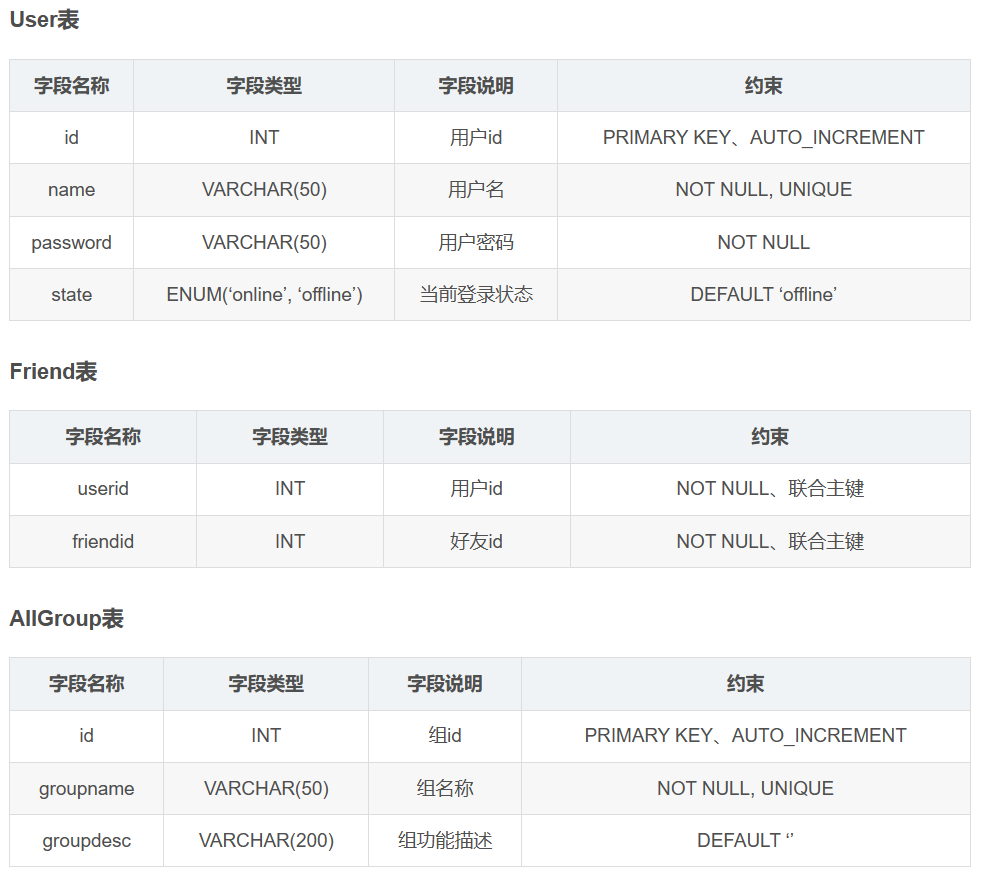
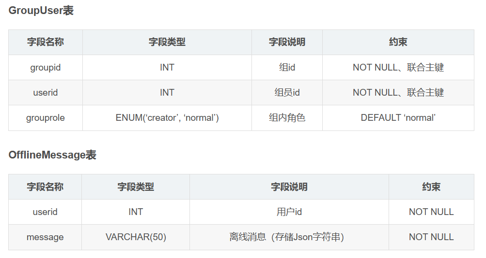
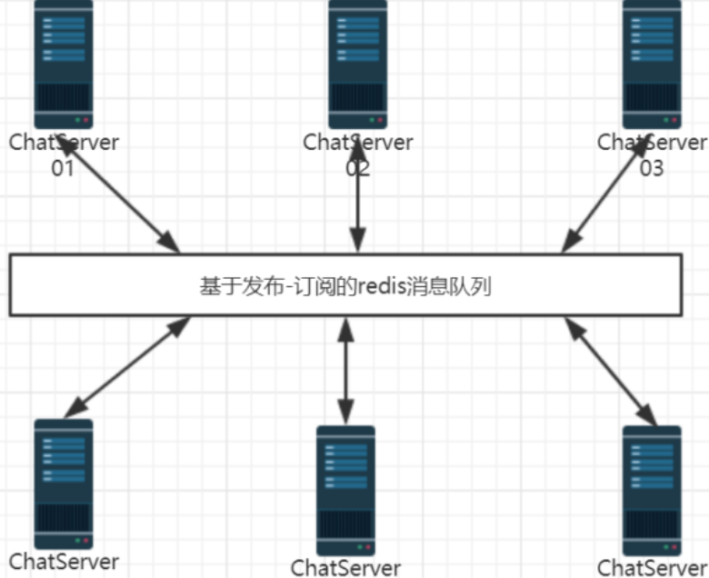

# chatserver

## 项目描述
 项目主要是模仿qq去实现一个聊天服务器，主要业务有注册、登录、加好友、查看离线消息、一对一群聊、创建群、加入群、群聊、注销等业务。

## 实现解耦网络层与业务层
解耦网络层与业务层是一种设计原则，也称为「分层架构」（layered architecture）。它可以帮助您更好地组织代码、提高代码的可重用性和可测试性，同时也使得系统更加易于理解和维护。
#

## 下面是一些常见的方法来解耦网络层与业务层：

1.使用接口（interface）或协议（protocol）来分离网络层和业务层。在网络层和业务层之间定义一个接口或协议，让网络层负责处理所有与网络相关的事情，例如TCP/IP连接、请求/响应模型、数据序列化/反序列化等。而业务层则负责处理具体的业务逻辑。
2.使用中间件（middleware）或框架（framework）来实现解耦。例如，可以使用一个HTTP框架（如Flask、Express、Django等）来处理网络请求，然后将请求参数传递给业务层进行处理。
3.使用事件驱动（event-driven）或消息队列（message queue）模型来解耦。这种方法可以让网络层和业务层独立地运行，通过事件或消息来通信。

### 本项目运用回调函数来实现网络层与业务层的解耦问题

##
## 如何存储数据
#### 使用mysql关系型数据库作为项目的数据存储，使用数据库连接池提高数据库的数据存取性能

#

## 怎样实现集群方面，可以采用以下几种方法：

水平伸缩（horizontal scaling）。这种方法可以通过增加服务器数量来提高系统的吞吐量和可用性。

负载均衡（load balancing）。这种方法可以通过分配请求到不同的服务器来提高系统的性能和可靠性。

分布式存储（distributed storage）。这种方法可以通过分布式文件系统或分布式数据库来存储大量的数据。

#### 本项目主要通过配置nginx基于tcp的负载均衡模块，来实现后端的并发能力，并实现服务器集群

#
## 如何实现跨服务器通信 
RPC（Remote Procedure Call）。这种方法可以通过调用远程函数来实现跨服务器通信。

RESTful API。这种方法可以通过HTTP请求来实现跨服务器通信。

消息队列（message queue）。这种方法可以通过发布/订阅模式来实现跨服务器通信。

### 本项目主要采用redis的发布/订阅进行跨服务器通信服务

#

## 数据库表设计

#

## 网络模块设计

我们会使用 muduo 完成网络模块的代码，在这之前我们需要了解 muduo 的基本使用。

muduo 的线程模型为「one loop per thread + threadPool」模型。一个线程对应一个事件循环（EventLoop），也对应着一个 Reactor 模型。EventLoop 负责 IO 和定时器事件的分派。

muduo 是主从 Reactor 模型，有 mainReactor 和 subReactor。mainReactor通过 Acceptor 接收新连接，然后将新连接派发到 subReactor 上进行连接的维护。这样 mainReactor 可以只专注于监听新连接的到来，而从维护旧连接的业务中得到解放。同时多个 Reactor 可以并行运行在多核 CPU 中，增加服务效率。因此我们可以通过 muduo 快速完成网络模块。

### 使用 muduo 注册消息事件到来的回调函数，并根据得到的 MSGID 定位到不同的处理函数中。以此实现业务模块和网络模块的解耦。
#

## 业务模块设计
注册模块

登录模块

客户端异常退出模块

服务端异常退出模块

点对点聊天模块

添加好友模块

群组模块
#
## Nginx负载均衡模块

#### 选择 Nginx 的 tcp 负载均衡模块的原因：

把client的请求按照负载算法分发到具体的业务服务器ChatServer上
能够ChantServer保持心跳机制，检测ChatServer故障
能够发现新添加的ChatServer设备，方便扩展服务器数量

#
## redis发布-订阅功能解决跨服务器通信

## 服务器设计上存在的一些问题：

如果服务器宕机，正在连接该服务的用户数据怎么办？

服务器缺少一个文件服务器来提供数据模块所需的信息

服务器和文件服务器是直接连接查询还是服务器存储一部分信息然后隔段时间同步一下

加好友的时候应该像QQ那样发送请求，然后等待对方接受再写入

## 参考文献
[1] 施磊．集群聊天服务器．图论科技.2020.7．
